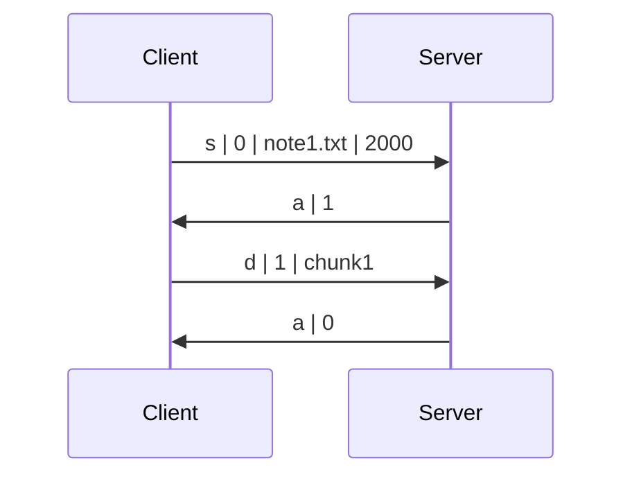

# Week 1 - [Stop-and-Wait ARQ](https://en.wikipedia.org/wiki/Stop-and-wait_ARQ)

> Distributed and Networking Programming - Spring 2024

## Task

Your task for this lab is to **write a UDP server** using Python [socket](https://docs.python.org/3/library/socket.html) module that communicates with the **provided** client.

The client reads a file from the local file system and uploads it to the server. Note that server should support multiple clients at once and limit the number of current "connections".

### Client Implementation (provided for you)

1. Client starts by sending a message in the format: `s|0|filename.ext|filesize`, where:
   - `s` means that the message type is "start";
   - `0` is the initial sequence number;
   - `filename.ext` is the name of the file to be sent (with extension);
   - `filesize` is the total size of the file to be sent (in bytes).

2. The client then expects a reply from the server in the format: `a|seqno`, where:
   - `a` means that the message type is "acknowledgement";
   - `seqno` is equal to `(x+1)%2`, where `x` is the sequence number of the message to be acknowledged.

3. If the expected server acknowledgement was received successfully, the client does the following:
   1. Split the file into chunks so that the size of a single data packet (including headers) does not exceed the buffer size of the server.
   2. Start sending file chunks, one by one, where each chunk is a message in format `d|seqno|data`, where:
      - `d` means that the message type is "data";
      - `seqno` is the sequence number of the data message, it alternates between `1` and `0`, starting from `1`;
      - `data` is the raw bytes of the file.
   3. Wait for an acknowledgement message after sending each chunk.

4. If an acknowledgement message arrives with an unexpected sequence number, the client ignores that duplicate ACK and keeps waiting for the expected ACK.

5. If an expected acknowledgement message does not arrive within 1 second, the client retransmits the message.

6. If the message is "negative acknowledgement" (see server description for details), it means that server is overloaded, and client exits.

### Server Implementation (your task)

1. Parse two integer arguments from the command line: the port number to listen on and the maximum number of simultaneously connected clients.

2. Create a UDP socket and start listening for incoming messages on `0.0.0.0:<port>`. Server should use a fixed receiver buffer size of 20480 bytes (20 Kibibytes).

3. Server should keep track of currently connected clients (i.e. clients that are transmitting file) in order to be able to reject new connections and differentiate incoming data packets.

4. Upon receiving a message from a client, act accordingly depending on the message type:
   - If the message type is `s` (start):
     - If current number of connected clients is less than limit, prepare to receive a file from the client with the given name and size. Reply with `a|seqno` (acknowledgement).
     - Otherwise, reject this new connection — reply with `n|seqno` (negative acknowledgement).
   - If the message type is `d` (data), write the delivered chunk to the file system. Reply with `a|seqno`.
   - Otherwise, terminate gracefully with an error.

5. Once the file is received completely, the server should print an indicating message, write the content to the file system, close the file and "close" the connection. "Close connection" means that the current number of transmitting clients is decreased, and the server could now accept new clients, if it was in limit.

6. If an existing file with the same name is present in the server directory, the server should print an indicating message and overwrite that file with the new one. You can assume that no clients can send a file with the same name simultaneously.

7. The server stays running unless a fatal error occurs or a `KeyboardInterrupt` is received.

> Your server will be tested under constant delay and packet loss. The Linux command below can be used to simulate a 15% packet loss and 1100 milliseconds constant delay over the `lo` interface. File transfer should still succeed after applying the command.
>
> ```bash
> sudo tc qdisc add dev lo root netem loss 15% delay 1100ms
> ```
>
> To undo the effect run the command again with `del` instead of `add`.

## Testing

- The project structure looks like this:

  ```bash
  .
  ├── client
  │   ├── client.py
  │   ├── image.png
  │   ├── note1.txt
  │   ├── ...
  │   ├── note11.txt
  │   └── run_multiple_users.sh
  └── NameSurname.py
  ```

- Example run and output:

  ```bash
  $ python3 NameSurname.py 8080 10
  ('0.0.0.0', 8080):    Listening...
  ('127.0.0.1', 48256): s|0|note.txt|446
  ('127.0.0.1', 48256): d|1|chunk1
  ('0.0.0.0', 8080):    Received note.txt.
  ^C('0.0.0.0', 8080):  Shutting down...
  ```

  ```bash
  $ cd client
  $ python3 client.py 127.0.0.1:8080 note1.txt
  Client: s|0|note1.txt|446
  Server: a|1
  Client: d|1|chunk1
  Server: a|0
  ```

- Example session visualization:



- Resulting directory structure. The text file should arrive intact. For example:

  ```bash
  .
  ├── client
  │   ├── client.py
  │   ├── image.png
  │   └── note1.txt
  ├── NameSurname.py
  └── note1.txt
  ```

- Simultaneous connections case (here we limit the maximum number of connections to 1): 

```bash
$ python3 NameSurname.py 8080 1
('0.0.0.0', 8080):      Listening...
('127.0.0.1', 64594):   s|0|note9.txt|4
('127.0.0.1', 62172):   s|0|note2.txt|4
('127.0.0.1', 54707):   s|0|note7.txt|4
('127.0.0.1', 53845):   s|0|note10.txt|4
('127.0.0.1', 64480):   s|0|note2.txt|4
('127.0.0.1', 64594):   d|1|chunk1
('0.0.0.0', 8080):      Received note9.txt.
('127.0.0.1', 58166):   s|0|note1.txt|996
('127.0.0.1', 65448):   s|0|note11.txt|4
('127.0.0.1', 64593):   s|0|note4.txt|4
('127.0.0.1', 58166):   d|1|chunk1
('0.0.0.0', 8080):      Received note1.txt.
('127.0.0.1', 58175):   s|0|note6.txt|4
('127.0.0.1', 58175):   d|1|chunk1
('0.0.0.0', 8080):      Received note6.txt.
('127.0.0.1', 51402):   s|0|note8.txt|4
('127.0.0.1', 59222):   s|0|note5.txt|4
('127.0.0.1', 51402):   d|1|chunk1
('0.0.0.0', 8080):      Received note8.txt.
^C('0.0.0.0', 8080):    Shutting down...
```

```bash
$ ./run_multiple_users.sh
Client: s|0|note7.txt|4                                          
Client: s|0|note8.txt|4
Server: a|1
1 1
Client: d|1|chunk1
Server: n|1
1 1
Client: Server is overloaded, exiting...
Server: a|0
0 0
Client: s|0|note11.txt|4
Client: s|0|note2.txt|4
Client: s|0|note4.txt|4
Client: s|0|note10.txt|4
Server: n|1
1 1
Client: Server is overloaded, exiting...
Server: a|1
1 1
Client: d|1|chunk1
Server: n|1
1 1
Client: Server is overloaded, exiting...
Server: n|1
1 1
Client: Server is overloaded, exiting...
Client: s|0|note5.txt|4
Client: s|0|note1.txt|996
Client: s|0|note2.txt|4
Server: a|0
0 0
Client: s|0|note9.txt|4
Server: a|1
1 1
Client: d|1|chunk1
Client: s|0|note6.txt|4
Server: n|1
1 1
Client: Server is overloaded, exiting...
Server: n|1
1 1
Client: Server is overloaded, exiting...
Server: n|1
Server: a|0
0 0
1 1
Client: Server is overloaded, exiting...
Server: a|1
1 1
Client: d|1|chunk1
Server: a|0
0 0
❯ 
❯ ./run_multiple_users.sh
Client: s|0|note9.txt|4                                          
Client: s|0|note2.txt|4
Client: s|0|note7.txt|4
Client: s|0|note10.txt|4
Client: s|0|note2.txt|4
Server: a|1
1 1
Client: d|1|chunk1
Server: n|1
1 1
Client: Server is overloaded, exiting...
Server: n|1
1 1
Client: Server is overloaded, exiting...
Client: s|0|note1.txt|996
Server: n|1
1 1
Client: Server is overloaded, exiting...
Client: s|0|note11.txt|4
Server: n|1
1 1
Client: Server is overloaded, exiting...
Client: s|0|note4.txt|4
Server: a|0
0 0
Server: a|1
1 1
Client: d|1|chunk1
Client: s|0|note6.txt|4
Server: n|1
1 1
Client: Server is overloaded, exiting...
Server: n|1
1 1
Client: Server is overloaded, exiting...
Server: a|0
0 0
Server: a|1
1 1
Client: d|1|chunk1
Client: s|0|note8.txt|4
Server: a|0
0 0
Client: s|0|note5.txt|4
Server: a|1
1 1
Client: d|1|chunk1
Server: n|1
1 1
Client: Server is overloaded, exiting...
Server: a|0
0 0
```

## Checklist and Grading Criteria

Submitted solution should satisfy the requirements listed below. Failing to satisfy an item will result in partial grade deduction or an assignment failure (depending on the severity). Assume that task costs 10 points and your grade cannot be negative.

- [ ] A single file with the source code is submitted to Moodle on time and named according to the format: `NameSurname.py`. _(-10 points for non-compliance)_
- [ ] Code runs successfully under the [latest stable Python interpreter](https://www.python.org/downloads/). _(-10 points for non-compliance)_
- [ ] Code only imports dependencies from the [Python standard library](https://docs.python.org/3/library/index.html), i.e. no external dependencies allowed. _(-10 points for non-compliance)_
- [ ] Sever is operating correctly with provided client implementation. _(-10 points for non-compliance)_
- [ ] Sent text/binary file and the corresponding received one are identical, i.e. files do not get corrupted during transmission. _(-10 points for non-compliance)_
- [ ] Server implementation works under constant delay and packet loss. _(-4 points for non-compliance)_
- [ ] Server is able to handle multiple clients and limit the number of clients.
   - -5 points if server is not able to handle multiple clients, or
   - -3 points if server is able to handle multiple clients, but is not able to limit the number of clients.
- [ ] Server uses the same format for informative messages as in examples. _(-1 point for non-compliance)_
- [ ] Server correctly sets buffer size for reading packets. _(-1 point for non-compliance)_
- [ ] Source code is readable and nicely formatted (e.g. according to [PEP8](https://peps.python.org/pep-0008/)). _(-1 point for non-compliance)_
- [ ] Source code is the author's original work. _(-10 points and case submission to DOE for non-compliance, both parties will be penalized for detected plagiarism)_

The list may not be fully complete. We preserve the right to deduct points for any other non-listed error.
